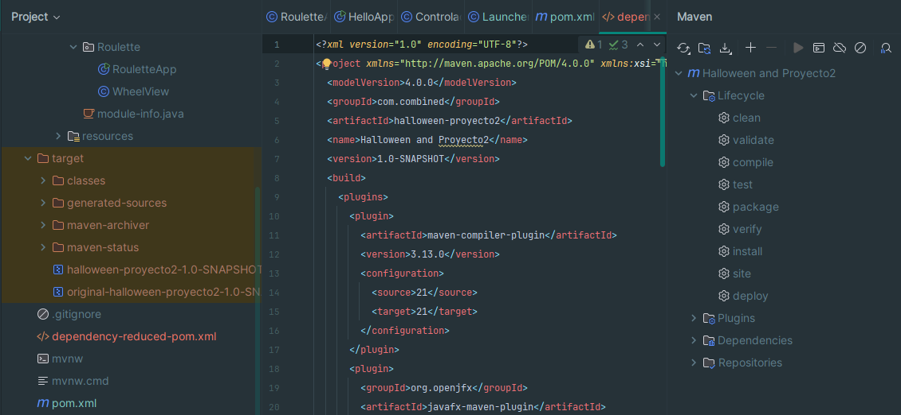

# 🎃 Túnel del Terror - JavaFX Desktop Application


## 📋 Descripción del Proyecto

**Túnel del Terror** es una aplicación de escritorio desarrollada en **JavaFX**. Este repositorio documenta la implementación de un **ciclo completo de distribución de software** (Release Engineering).

El objetivo principal ha sido transformar un proyecto de código fuente Java en un **producto final profesional para Windows**, generando un instalador (`setup.exe`) que gestiona dependencias, accesos directos y licencias, permitiendo su ejecución en equipos que no tienen Java instalado.

---

## 🛠️ Tecnologías y Herramientas

| Herramienta | Función en el Proyecto |
| :--- | :--- |
| **JavaFX & JDK 21** | Desarrollo de la interfaz gráfica y lógica del juego. |
| **Apache Maven** | Gestión de dependencias y compilación del artefacto (Fat JAR). |
| **Launch4j** | Empaquetado del JAR en un contenedor nativo `.exe`. |
| **Inno Setup** | Creación del asistente de instalación y despliegue de archivos. |

---

## 🚀 Flujo de Trabajo (Workflow)

### 1. Construcción del Artefacto (Maven) 📦
Se utilizó el plugin `maven-shade-plugin` para empaquetar el código y todas sus dependencias en un único archivo JAR ejecutable.

> **Comando:** `mvn clean package`



### 2. Wrapper Nativo (Launch4j) 🍬
Se configuró un ejecutable de Windows para envolver el JAR.
* **Configuración:** Modo GUI (sin consola).
* **Dependencias:** Se vinculó un JRE portable local usando rutas relativas.


*(Sustituye esta imagen por tu captura de configuración de Launch4j)*

### 3. Distribución (Inno Setup) 💿
Se generó un script `.iss` para compilar el instalador final.
* Inclusión de Licencia (EULA).
* Creación de claves de Registro.
* Despliegue de la estructura de carpetas correcta.


*(Sustituye esta imagen por tu captura del script de Inno Setup)*

---

## ⚠️ Desafíos Encontrados y Soluciones

Durante el proceso de empaquetado y distribución surgieron varios retos técnicos que fueron resueltos de la siguiente manera:

### 1. Portabilidad del JRE (Java Runtime Environment)
* **Problema:** El ejecutable `.exe` fallaba en ordenadores que no tenían Java instalado.
* **Solución:** Se incluyó una carpeta `jre` completa dentro del paquete. En Launch4j, se configuró la ruta dinámica `%EXEDIR%\jre`. Esto asegura que el juego use siempre su propia versión de Java, independientemente del sistema anfitrión.

### 2. Rutas Absolutas vs. Relativas en el Instalador
* **Problema:** Al mover la carpeta del proyecto a una nueva ubicación, el script de Inno Setup dejó de encontrar los archivos fuente.
* **Solución:** Se refactorizó el script `.iss` actualizando las directivas `Source` y `OutputDir` para apuntar a la nueva estructura de directorios relativa.

### 3. Error en la Estructura de Directorios (DestDir)
* **Problema Crítico:** El instalador volcaba el contenido del JRE (`bin`, `lib`, etc.) directamente en la raíz de la carpeta de instalación, mezclándolo con el ejecutable. Esto hacía que Launch4j no encontrara la ruta `\jre\bin\java.exe`.
* **Solución:** Se corrigió la directiva de destino en el script `.iss`.
    * *Incorrecto:* `DestDir: "{app}"`
    * *Correcto:* `DestDir: "{app}\jre"`
    * Esto forzó al instalador a crear la subcarpeta necesaria para que el ejecutable funcionara correctamente.

### 4. Recursos y Licencias
* **Problema:** El instalador por defecto era genérico y no incluía términos legales.
* **Solución:** Se añadieron explícitamente las directivas `LicenseFile` y `SetupIconFile` en el script, vinculando los archivos `.txt` e `.ico` personalizados.

---

## 📂 Estructura del Proyecto

```text
Túnel-Del-Terror/
├── 📂 src/                        # Código Fuente
├── 📂 TrucoOTratoAppInstaller/    # Archivos de Distribución
│   ├── 📂 output/                 # Carpeta donde se genera el setup.exe
│   ├── 📂 jre/                    # Entorno Java portable
│   ├── 📄 Trucaso.exe             # Ejecutable intermedio
│   ├── 📄 script_instalador.iss   # Script de Inno Setup
├── 📄 pom.xml                     # Configuración Maven
└── 📄 README.md                   # Documentación
```
## 💿 Instrucciones de Instalación

1.  Descarga el archivo **`InstaladorTunelTerror.exe`** desde la carpeta `output` o la sección de Releases.
2.  Ejecuta el instalador y acepta los términos de licencia.
3.  Busca el acceso directo **"Túnel del Terror"** en tu escritorio y ejecútalo.

> **Desinstalación:** El juego se puede eliminar limpiamente desde el *Panel de Control > Programas y Características*.

---

## ✒️ Autor
* **Iván Sánchez** - *Desarrollo, Ingeniería de Lanzamiento y Documentación*
* **Asignatura:** Desarrollo de Interfaces
