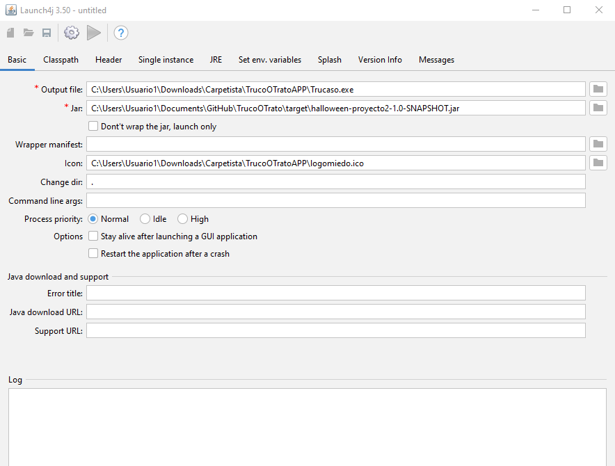
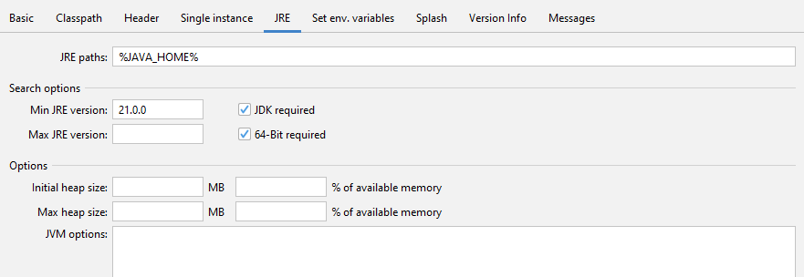
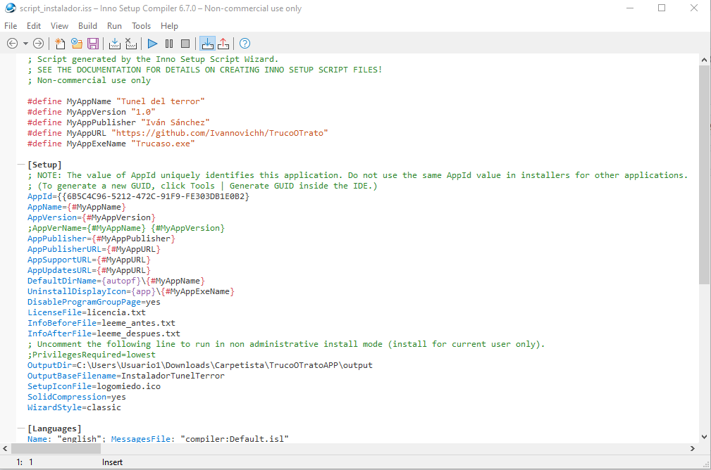

# 🎃 Túnel del Terror - JavaFX Desktop Application


## 📋 Descripción del Proyecto

**Túnel del Terror** es una aplicación de escritorio desarrollada en **JavaFX**. Este repositorio documenta la implementación de un **ciclo completo de distribución de software** (Release Engineering).

El objetivo principal ha sido transformar un proyecto de código fuente Java en un **producto final profesional para Windows**, generando un instalador (`setup.exe`) que gestiona dependencias, accesos directos y licencias, optimizado para una distribución ligera.

---

## 🛠️ Tecnologías y Herramientas

| Herramienta | Función en el Proyecto |
| :--- | :--- |
| **JavaFX & JDK 21** | Desarrollo de la interfaz gráfica y lógica del juego. |
| **Apache Maven** | Gestión de dependencias y compilación del artefacto (Fat JAR). |
| **Launch4j** | Wrapper nativo (`.exe`). Configurado para validar la presencia de **Java 21** y redirigir a la descarga oficial si no se encuentra. |
| **Inno Setup** | Creación del asistente de instalación y despliegue de archivos. |

---

## 🚀 Flujo de Trabajo (Workflow)

### 1. Construcción del Artefacto (Maven) 📦
Se utilizó el plugin `maven-shade-plugin` para empaquetar el código y todas sus dependencias en un único archivo JAR ejecutable.

> **Comando:** `mvn clean package`


### 2. Wrapper Nativo (Launch4j) 🍬
Se configuró un ejecutable de Windows para envolver el JAR.
* **Configuración:** Modo GUI (sin consola).
* **Dependencias:** Validación de versión mínima (21.0.0) y redirección web automática en caso de error.




### 3. Distribución (Inno Setup) 💿
Se generó un script `.iss` para compilar el instalador final.
* Inclusión de Licencia (EULA).
* Creación de claves de Registro.
* Compilación optimizada sin archivos innecesarios.



---

## ⚠️ Desafíos Encontrados y Soluciones

Durante el proceso de empaquetado y distribución surgieron varios retos técnicos que fueron resueltos de la siguiente manera:

### 1. Rutas Absolutas vs. Relativas
* **Problema:** Al mover la carpeta del proyecto a una nueva ubicación, el script de Inno Setup dejó de encontrar los archivos fuente.
* **Solución:** Se refactorizó el script `.iss` actualizando las directivas `Source` y `OutputDir` para apuntar a la nueva estructura de directorios relativa.

### 2. Error en la Estructura de Directorios (DestDir)
* **Problema Crítico:** En versiones previas, el instalador mezclaba archivos en la raíz, rompiendo la estructura esperada.
* **Solución:** Se corrigieron las directivas `DestDir` en el script `.iss` para asegurar la jerarquía correcta.

### 3. Recursos y Licencias
* **Problema:** El instalador por defecto era genérico.
* **Solución:** Se añadieron explícitamente las directivas `LicenseFile` y `SetupIconFile` en el script, vinculando los recursos personalizados.

### 4. Optimización del Distribuidor (Peso del Instalador)
* **Problema:** Inicialmente se incluyó un JRE portable completo, lo que aumentaba el tamaño del instalador a más de 180MB, dificultando su distribución en repositorios como GitHub.
* **Solución:** Se reconfiguró Launch4j para utilizar el Java del sistema o guiar al usuario a la descarga oficial de Oracle si no se detecta la versión 21. Esto redujo el peso final del instalador a **20MB**, simulando un entorno de producción optimizado para bajo ancho de banda.

---

## 📂 Estructura del Proyecto

```text
Túnel-Del-Terror/
├── 📂 src/                        # Código Fuente
├── 📂 TrucoOTratoAppInstaller/    # Archivos de Distribución
│   ├── 📂 output/                 # Carpeta donde se genera el setup.exe
│   ├── 📂 Images/                 # Capturas para documentación
│   ├── 📄 Trucaso.exe             # Ejecutable intermedio
│   ├── 📄 script_instalador.iss   # Script de Inno Setup
│   └── 📄 licencia.txt            # Términos de uso
├── 📄 pom.xml                     # Configuración Maven
└── 📄 README.md                   # Documentación
```
## 💿 Instrucciones de Instalación

1.  Descarga el archivo **`InstaladorTunelTerror.exe`** desde la sección de **Releases** (a la derecha en GitHub).
2.  Ejecuta el instalador.
    * **Nota:** El juego requiere **Java 21**. Si no lo tienes instalado, se abrirá automáticamente la página de descarga oficial al intentar abrir el juego.
3.  Acepta los términos de licencia y completa la instalación.
4.  Busca el acceso directo **"Túnel del Terror"** en tu escritorio y ejecútalo.

> **Desinstalación:** El juego se puede eliminar limpiamente desde el *Panel de Control > Programas y Características*.

---

## ✒️ Autor
* **Iván Sánchez** - *Desarrollo, Ingeniería de Lanzamiento y Documentación*
* **Asignatura:** Desarrollo de Interfaces
